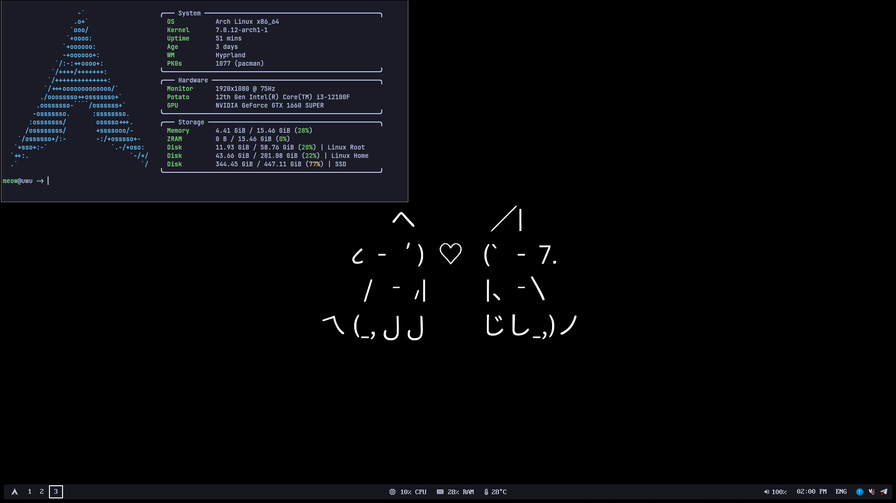

# My first Hyprland rice



## Details
- **WM:** Hyprland
- **Bar:** Waybar
- **Terminal:** Kitty
- **Launcher:** Wofi
- **Shell:** Fish
- **Notifications:** Dunst
- **Wallpapers:** Hyprpaper
- **Screenshots:** grim + slurp
- **Clipboard:** cliphist + wl-clipboard

## Dependencies
Install the following packages *(Arch example)*:
```bash
sudo pacman -S hyprland waybar kitty hyprpaper fish wofi dunst \
    grim slurp wl-clipboard cliphist brightnessctl playerctl pavucontrol \
    polkit-kde-agent fastfetch stow
```

## Installation
Clone and symlink:
```bash
git clone https://github.com/justyXOR/dotfiles ~/dotfiles
cd ~/dotfiles
stow .
```

## Keybindings
| **Key**                | **Action**                                          |
|------------------------|-----------------------------------------------------|
| Super + X              | Open terminal                                       |
| Super + E              | Open file manager                                   |
| Super + Space          | Launch menu                                         |
| Super + Shift + S      | Screenshot area *(saves to ~/Pictures/Screenshots)* |
| Super + V              | Clipboard history                                   |
| Super + D              | Toggle floating window                              |
| Super + F              | Fullscreen tile                                     |
| Super + Q              | Kill window                                         |
| Super + W              | Close window                                        |
| Super + 1-0            | Switch workspace                                    |
| Super + Scroll Down/Up | Scroll through workspaces                           |

## Notes
+ All path relative, so they should work out-of-the-box.
